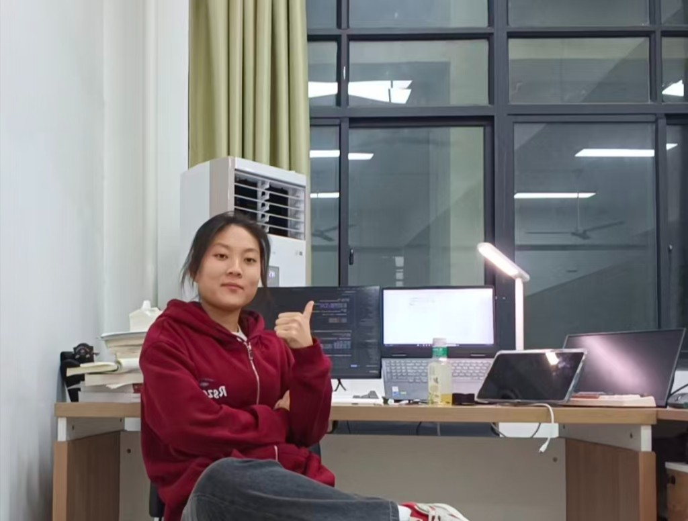

# 👋 Hello, I'm  Yue Wang(王玥)

*Electrical Engineering and Automation student | Robotics & Embedded Systems Enthusiast*

📍 Yangzhou University, China | Class of 2023

📧 [233302124@stu.yzu.edu.cn / 2574414382@qq.com](mailto:2574414382@qq.com) 

---

## 🎓 Education

**Yangzhou University** — B.E. in Electrical Engineering and Automation  
*September 2023 – Present*

---

## 🏆 Awards & Achievements

### 🥇 National-Level Awards (Team Leader)
| Competition | Award |
|-------------|-------|
| National Undergraduate Electronics Design Contest | **National Second Prize** (UAV - H Topic) |
| RoboCom Robot Developer Competition | **National First Prize** (Air Reconnaissance) |
| China Robot & AI Competition | **National Third Prize** (Micro-UAV) |
| RoboCup China Open | **National Third Prize** ×2 (UAV Racing) |
| National Embedded Chip & System Design Contest | **National Third Prize** (Battery Balancing) |

### 🥈 Provincial-Level Awards
- Mathematical Contest in Modeling (China) — Second Prize
- MCM/ICM — H Price (Honorable Mention)
- Blue Bridge Cup (Embedded) — Second Prize
- National IC Innovation & Entrepreneurship Contest — Third Prize
- National Statistical Modeling Contest — Third Prize
- National Optoelectronic Design Contest — Second Prize
- Etc.

---

## 📄 Publications

### Published
1. **Wang Yue**, et al. "Optimization of Ultrasonic Flowmeter Velocity Algorithm Under Different Flow Regimes." *Journal of Electronic Measurement and Instrumentation* — First Author (EI, Chinese Core). DOI: 10.13382/j.jemi.B2508365 

2. **Wang Yue**, et al. "Improved Equations for Core Loss Prediction Under Asymmetric Triangular Excitation Waveforms Based on Improved Generalized Steinmetz Equation." *Journal of Magnetism and Magnetic Materials* — First Author (SCI Q3, IF: 3.0). DOI: 10.1016/j.jmmm.2026.174052 

### Patent
3. **Wang Yue**, et al. "Profibus-DP Ultrasonic Flowmeter and Flow Calculation Method Based on Domestic Communication Chip" (Under Substantive Examination) — First Author

---

## 💼 Experience

**AIIT, Peking University**  
*Developer — Quadruped Robot Autonomous Navigation System*  
*January – May 2026*

- Developed autonomous navigation system for quadruped robots enabling indoor/outdoor dynamic obstacle avoidance and global path planning

---

## 🛠️ Technical Skills

### Embedded Development
- **STM32 Series:** F1/F3/F4/G4/H7, HRTIM high-precision control
- **PX4 Flight Control:** uORB communication, FreeRTOS, Offboard mode development

### Operating Systems & Hardware
- **Linux:** Ubuntu 18.04/20.04
- **Edge Computing:** Jetson Orin Nano/Nano
- **PCB Design:** Schematic capture & Layout (switching power supply design)

### Algorithms & Robotics
| Domain | Tools |
|--------|-------|
| SLAM | Cartographer, Fast-LIO2, Hector SLAM |
| Planning | Ego-Planner, Fast-Planner, A*, DWA |
| Vision/AI | OpenCV, YOLO |
| Middleware | ROS1 Noetic, ROS2 Foxy |

### Programming Languages
- **C/C++** (Primary)
- **MATLAB**
- **Python**

---

## 💡 About Me

**MBTI:** INTJ 

> *"Humans, like systems, can be predicted."*

I'm fascinated by the intersection of **Eastern metaphysics**  and **Control science** — where ancient wisdom meets modern complexity theory. Whether it's predicting particle trajectories in physics or life patterns through the lens of destiny, I believe everything follows underlying rules.

-  High-intensity research is just another stress test — I treat it like debugging a stubborn system
-  From soldering circuits to tuning SLAM parameters — if it has inputs and outputs, I want to understand it
-  Literature review → reproduce → improve → publish. Simple workflow, not easy execution

---

⭐ *Open to interesting collaborations and  discussions about control, robotic, or UAVs*

